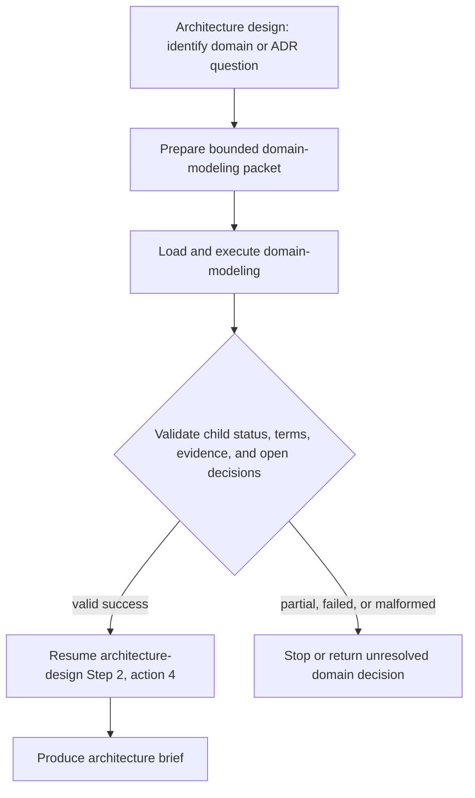

# Domain modeling handoff

Use this composition only when architecture work requires changing domain terminology, a project glossary, or an ADR. Loading provides the child skill's instructions; the Architect executes its bounded workflow and retains ownership of the architecture decision.

The packet carries the objective, current requirements, relevant glossary/ADR paths, code evidence, constraints, expected status and fields, and the exact parent resume point declared by `architecture-design/SKILL.md`.

