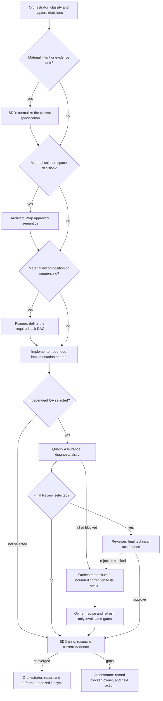

# Orchestration workflow graph

## use_case: risk_selected_delivery

Each gate is selected from task risk and acceptance policy; unselected phases are omitted and recorded, not treated as failures. This success path permits L0 work to go from focused implementation evidence directly to convergence, while a selected Reviewer gate requires current QA evidence. On failure or rejection, the Orchestrator routes to the evidence-indicated owner and reruns only invalidated selected gates.

The remediation node represents one new, versioned attempt, not an automatic loop. Record its owner and rerun only the selected gates invalidated by that revision; unresolved gaps return to the Orchestrator as blockers.
