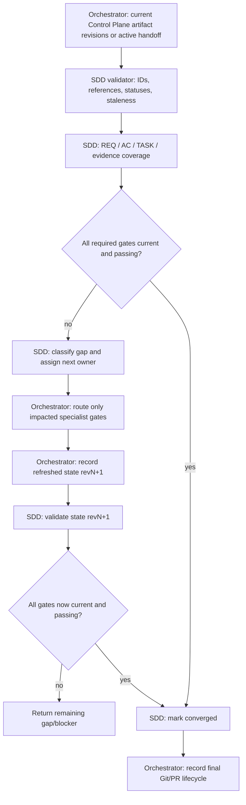

# Convergence Contract

Convergence reconciles the current specification, available Control Plane artifacts, and specialist evidence. It is not an Orchestrator code review: the Orchestrator checks IDs, statuses, revision links, coverage, blockers, and staleness, while the specialists own technical judgments. When durable Control Plane state is not required, use the active handoff/session and local evidence; do not create a local manifest to satisfy convergence.

## Required conditions

Declare `convergence.status: converged` only when all applicable conditions hold:

1. The supplied Control Plane specification is `ready`, required user decisions are resolved, and each supplied `AC-*` references an existing `REQ-*`. For standalone work, the active request is clear, decisions are resolved, and observable behavior statements are explicit without IDs.
2. When a Control Plane Task exists, it records the Orchestrator-assigned `risk_level` and selected `required_gates`; supplied legacy state without this field retains strict plan/implementation/QA/Reviewer checks. Without durable state, reconcile the assigned level and gates from the active handoff/session.
3. Each selected architecture or planning gate is current; an unselected gate is recorded as `not_required`. Supplied durable artifacts consume the current specification revision; standalone local handoffs use the active request and observed outcomes.
4. Every required implementation task is complete and has passing evidence for its scope and any supplied specification/implementation revisions. Link Control Plane Task IDs when they exist; standalone local workflows do not require or invent them.
5. Every required QA gate has passing evidence for the current implementation revision and covers every in-scope acceptance criterion. Link a Control Plane `QA-RUN-*` when allocated; standalone local QA returns its commands/results in the active handoff without minting a durable ID. If QA is not required, record it as `not_required`.
6. Reviewer approval is required only when `review` is selected. When Control Plane revisions exist, it must refer to the same specification and implementation revisions and current passing QA evidence. Standalone local review uses the active request plus the reviewed implementation and QA results, and returns its verdict in the handoff without minting an ID. If Review is not required, record it as `not_required`. A selected Review gate requires QA.
7. No required artifact is stale, no blocking finding or unresolved required decision remains, and no unrequested material change exists.
8. Repository lifecycle state is recorded by the Orchestrator after evidence convergence; this skill does not own branch, worktree, PR, merge, or cleanup operations.

## Gap categories

- `missing`: required behavior, task, or evidence is absent.
- `partial`: a criterion or required task is only partly satisfied.
- `contradicts`: implementation or evidence conflicts with canonical intent or an invariant.
- `unrequested`: material behavior has no supporting requirement.
- `stale`: evidence/artifact predates a relevant upstream revision.
- `blocked`: required proof cannot be obtained or a decision remains unresolved.

For each gap, record affected IDs/revisions, supporting evidence, owner, and the smallest next gate. After correction, rerun only the impacted implementation/QA/review chain, then reconcile convergence again.

## Coverage matrix

Use the validator's `--coverage` output to derive:

```text
REQ-* → AC-* → Control Plane TASK-* when present → implementation evidence → QA evidence (Control Plane QA-RUN when allocated) → review evidence (Control Plane REVIEW when allocated)
```

Orchestrator may aggregate evidence; it MUST NOT infer that unlinked evidence proves a criterion. A fresh validation record may satisfy a check without rerunning it when its subject revision, target, and environment still match.

## use_case: current_revision_convergence



Each return to validation consumes a newly recorded state revision; the actual dependency graph remains acyclic when each state snapshot is represented as a distinct node. Do not depict or implement convergence as a skill-call cycle.
