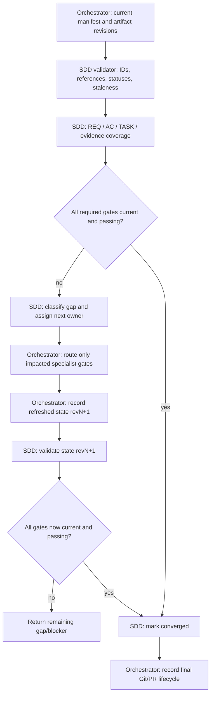

# Convergence Contract

Convergence reconciles canonical artifact state and specialist evidence. It is not an Orchestrator code review: the Orchestrator checks IDs, statuses, revision links, coverage, blockers, and staleness, while the specialists own technical judgments.

## Required conditions

Declare `convergence.status: converged` only when all applicable conditions hold:

1. The current specification is `ready`; required user decisions are resolved and each `AC-*` references existing `REQ-*`.
2. The manifest records the Orchestrator-assigned `risk_level` and selected `required_gates`; legacy states without this field retain strict plan/implementation/QA/Reviewer checks.
3. Each selected architecture or planning gate is current; an unselected gate is recorded as `not_required`. Any ready artifact consumes the current specification revision.
4. Every required implementation task is complete and has passing evidence for its current task, specification revision, and implementation revision.
5. Every required QA gate has a passing `QA-RUN-*` for the current implementation revision and covers every in-scope acceptance criterion. If QA is not required, record it as `not_required`.
6. Reviewer approval is required only when `review` is selected; it must refer to the same specification and implementation revisions and the current passing QA run. If Review is not required, record it as `not_required`. A selected Review gate requires QA.
7. No required artifact is stale, no blocking finding or unresolved required decision remains, and no unrequested material change exists.
8. Repository lifecycle state is recorded by the Orchestrator after evidence convergence; this skill does not own branch, worktree, PR, merge, or cleanup operations.

## Gap categories

- `missing`: required behavior, task, or evidence is absent.
- `partial`: a criterion or required task is only partly satisfied.
- `contradicts`: implementation or evidence conflicts with canonical intent or an invariant.
- `unrequested`: material behavior has no supporting requirement.
- `stale`: evidence/artifact predates a relevant upstream revision.
- `blocked`: required proof cannot be obtained or a decision remains unresolved.

For each gap, record affected IDs/revisions, supporting evidence, owner, and the smallest next gate. After correction, rerun only the impacted implementation/QA/review chain, then reconcile convergence again.

## Coverage matrix

Use the validator's `--coverage` output to derive:

```text
REQ-* → AC-* → TASK-* → implementation evidence → QA-RUN-* → REVIEW-*
```

Orchestrator may aggregate evidence; it MUST NOT infer that unlinked evidence proves a criterion. A fresh validation record may satisfy a check without rerunning it when its subject revision, target, and environment still match.

## use_case: current_revision_convergence



Each return to validation consumes a newly recorded state revision; the actual dependency graph remains acyclic when each state snapshot is represented as a distinct node. Do not depict or implement convergence as a skill-call cycle.
