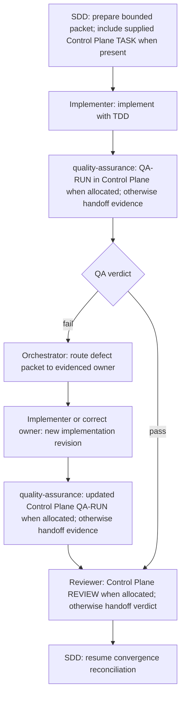

# Specialist Handoff Contracts

Every packet contains only the bounded work slice, applicable artifact IDs/revisions when supplied or required by its concrete workflow, assigned `risk_level`, selected required gates, relevant evidence, constraints, expected return fields, and exact next resume point. Supplied Control Plane task state is authoritative for durable state when present; otherwise, the explicit packet and current session are authoritative for the handoff. Standalone local packets do not require fabricated IDs. Specialists MUST NOT infer missing facts from hidden conversation history or downgrade assigned risk.

When a concrete handoff uses a machine-readable exchange packet, validate it with the packaged [validator](../../orchestrate/scripts/validate_exchange.py): `uv run --script <validator-path-resolved-from-this-skill> --kind handoff --input <packet.json>`. Add `--repo <repository-path>` whenever the packet contains commit or artifact claims, and `--repository-id <logical-repository-name>` when checking a named repository. A structurally valid packet with unresolved Git or artifact checks is not a verified handoff. Receivers MUST validate again because the producer's reported result may be stale or altered.

`git_commits[].commit_sha` is a Git commit object ID (40 hex for SHA-1 repositories or 64 hex for SHA-256 repositories). `artifacts[].sha256` is a SHA-256 digest over the exact file bytes (64 hex). Never put an artifact digest in a Git commit field or treat an unverified commit string as proof of changed files. If no commit was created, set `commit_status` to `not_created`, `not_applicable`, or `unknown` and provide `commit_reason`; do not invent a SHA or make a commit just to satisfy the packet.

For a merge commit, `git_commits[].changed_paths` means the complete path set changed between the merge commit and its first parent. The validator uses that first-parent comparison consistently, including octopus merges; list paths added, modified, or deleted by the merge result relative to that parent.

## Ownership and required traceability

- **Architect** receives the active request/specification context, any supplied revision and relevant IDs, approved semantic context, repository evidence, and constraints; returns technical decisions, architectural invariants, alternatives, and unresolved blockers. Control Plane IDs are included when supplied; standalone work does not require invented IDs. Architect MUST NOT redefine problem-space semantics.
- **Challenger** receives a materialized specification/architecture/plan proposal and its evidence; returns counterarguments, failure modes, reversibility, and disconfirming checks without making the final decision.
- **Planner** receives current spec and any required architecture revisions; returns phases and bounded task definitions only when decomposition adds value. Use Control Plane `TASK-*` IDs when supplied; do not invent them for standalone local work. Include available REQ/AC/ADR links, dependencies, separate phase exit criteria, validation obligations, and assigned risk. It maps but MUST NOT redefine spec-owned AC or semantic IDs.
- **Implementer** receives approved bounded scope plus relevant spec/architecture/semantic slices, assigned risk, validation obligations, and reusable evidence IDs. For Control Plane-backed work, include its supplied `TASK-*`; standalone local work does not require one. Implementer returns changed files, implementation revision, validation evidence (check, command, subject revision, environment, result, producer), and deviations. It uses TDD as an inner method and returns spec mismatches to the Orchestrator.
- **quality-assurance** receives the current specification independently, implementation revision, fresh validation evidence, assigned risk, and changed surfaces only when QA is a required gate; returns a Control Plane `QA-RUN-*` when one is allocated, otherwise returns commands/results in the handoff without minting a durable ID, plus verdict, falsification scope/method, available `REQ-*`/`AC-*` coverage, defect packets, and residual risk. A pass is not acceptance.
- **Reviewer** receives current request/specification context, required architecture/plan and Control Plane task context when relevant, implementation evidence, passing QA evidence when required, defect history, security-review findings when required, and assigned risk; returns a Control Plane `REVIEW-*` when one is allocated, otherwise returns its verdict and evidence in the handoff, plus any supplied revision references, evidence sufficiency, findings, and owners. It reuses fresh evidence rather than repeating identical checks.
- **Researcher** receives one exact, bounded evidence question, `requested_by` and a `supports_artifact` revision when one exists, needed source class, and a stop condition; standalone research does not require an invented task or artifact ID. Researcher returns sourced facts, versions, uncertainty, and decision implications without deciding the artifact.
- **DevOps** receives approved operational scope and validation obligations; include supplied Control Plane `TASK-*`, specification revision, and applicable REQ/AC when present. Standalone local operations do not require invented task IDs. DevOps returns changed surfaces, operational evidence, rollout/rollback risks, and environment limitations.

## Failure and resume

- A specialist MUST return `blocked` when upstream intent, architecture, or evidence is materially inconsistent; it MUST NOT repair upstream truth silently.
- QA failures return to the Orchestrator as defect packets, then to the owner established by evidence; QA repeats against the corrected implementation revision.
- Reviewer rejection returns to the Orchestrator for owner-based routing and only the necessary downstream gates.
- The Orchestrator updates Control Plane state after each return when connected and required, then passes only the required refreshed slice to the next specialist.

## use_case: risk_required_implementation_qa_review

This is the required-gate path when independent QA and final Review are selected. Lower-risk tasks may omit a gate only when the Orchestrator records that it is not required. The fix path is one remediation attempt with distinct nodes; further attempts use new revision-specific nodes.
