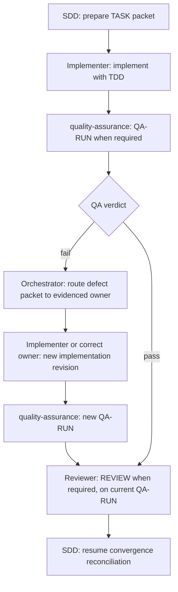

# Specialist Handoff Contracts

Every packet contains only the task slice, current artifact IDs/revisions, assigned `risk_level`, selected required gates, relevant evidence, constraints, expected return fields, and exact next resume point. The canonical task state is the source of truth; specialists MUST NOT infer missing facts from hidden conversation history or downgrade assigned risk.

Machine-readable exchange packets MUST use the versioned [handoff schema](../../orchestrate/schemas/handoff.schema.json). Before sending and before accepting a packet, validate it with `uv run --script <absolute-path-to-validate_exchange.py> --kind handoff --input <packet.json>`; add `--repo <absolute-repository-path>` whenever the packet contains commit or artifact claims, and `--repository-id <logical-repository-name>` when checking a named repository. A structurally valid packet with unresolved Git or artifact checks is not a verified handoff. Receivers MUST validate again because the producer's reported result may be stale or altered.

`git_commits[].commit_sha` is a Git commit object ID (40 hex for SHA-1 repositories or 64 hex for SHA-256 repositories). `artifacts[].sha256` is a SHA-256 digest over the exact file bytes (64 hex). Never put an artifact digest in a Git commit field or treat an unverified commit string as proof of changed files. If no commit was created, set `commit_status` to `not_created`, `not_applicable`, or `unknown` and provide `commit_reason`; do not invent a SHA or make a commit just to satisfy the packet.

For a merge commit, `git_commits[].changed_paths` means the complete path set changed between the merge commit and its first parent. The validator uses that first-parent comparison consistently, including octopus merges; list paths added, modified, or deleted by the merge result relative to that parent.

## Ownership and required traceability

- **Architect** receives specification revision, relevant `REQ-*`/`AC-*`, approved semantic IDs, repository evidence, and constraints; returns technical `ADR-*`, architectural invariants, alternatives, and unresolved blockers. It MUST NOT redefine problem-space semantics.
- **Challenger** receives a materialized specification/architecture/plan proposal and its evidence; returns counterarguments, failure modes, reversibility, and disconfirming checks without making the final decision.
- **Planner** receives current spec and any required architecture revisions; returns phases and `TASK-*` only when decomposition adds value, with REQ/AC/ADR links, dependencies, separate phase exit criteria, validation obligations, and assigned risk. It maps but MUST NOT redefine spec-owned AC or semantic IDs.
- **Implementer** receives one approved `TASK-*` plus relevant spec/architecture/semantic slices, assigned risk, validation obligations, and reusable evidence IDs; returns changed files, implementation revision, validation evidence (check, command, subject revision, environment, result, producer), and deviations. It uses TDD as an inner method and returns spec mismatches to the Orchestrator.
- **quality-assurance** receives the current specification independently, implementation revision, fresh validation evidence, assigned risk, and changed surfaces only when QA is a required gate; returns `QA-RUN-*`, verdict, falsification scope/method, `REQ-*`/`AC-*` coverage, defect packets, and residual risk. A pass is not acceptance.
- **Reviewer** receives current spec, required architecture/plan/task state, implementation evidence, passing QA run when required, defect history, security-review findings when required, and assigned risk; returns `REVIEW-*`, verdict, revision references, evidence sufficiency, findings, and owners. It reuses fresh evidence rather than repeating identical checks.
- **Researcher** receives one exact, bounded evidence question, `requested_by`, `supports_artifact` with revision, needed source class, and a stop condition; returns only sourced facts, versions, uncertainty, and decision implications without deciding the artifact.
- **DevOps** receives approved operational `TASK-*`, specification revision, applicable REQ/AC, and operational validation obligations; returns changed surfaces, operational evidence, rollout/rollback risks, and environment limitations.

## Failure and resume

- A specialist MUST return `blocked` when upstream intent, architecture, or evidence is materially inconsistent; it MUST NOT repair upstream truth silently.
- QA failures return to the Orchestrator as defect packets, then to the owner established by evidence; QA repeats against the corrected implementation revision.
- Reviewer rejection returns to the Orchestrator for owner-based routing and only the necessary downstream gates.
- The Orchestrator updates canonical state after each return and passes only the required refreshed slice to the next specialist.

## use_case: risk_required_implementation_qa_review

This is the required-gate path when independent QA and final Review are selected. Lower-risk tasks may omit a gate only when the Orchestrator records that it is not required. The fix path is one remediation attempt with distinct nodes; further attempts use new revision-specific nodes.
