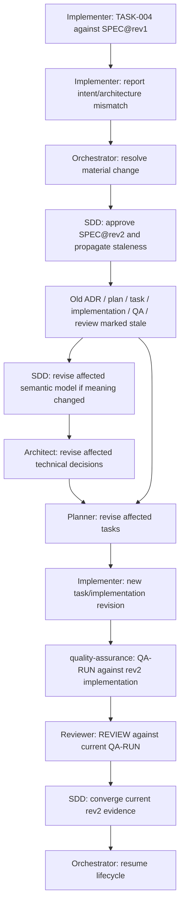

# Specification Workflow

## Method reference

This skill adapts the Spec Kit sequence (specify, clarify, plan, tasks, implement, converge) to the repository's Orchestrator/agent ownership; it does not copy Spec Kit prompts or introduce its feature-directory store.

- [Spec Kit process index](https://github.com/github/spec-kit/blob/main/docs/index.md)
- [Spec Kit quickstart](https://github.com/github/spec-kit/blob/main/docs/quickstart.md)
- [Agentic SDD reference](https://github.com/github/spec-kit/blob/main/docs/reference/agentic-sdd.md)
- [Evolving specifications](https://github.com/github/spec-kit/blob/main/docs/guides/evolving-specs.md)

## Normalization sequence

1. Extract the objective, observable behavior, rationale, constraints, non-goals, assumptions, acceptance criteria, and user-owned open decisions from the request and relevant repository evidence.
2. Clarify only when unresolved intent materially changes behavior, scope, acceptance, architecture possibilities, or risk. Do not ask the user to decide technical details that can be established from repository evidence or Researcher findings.
3. Assign stable IDs to the canonical specification, requirements, and acceptance criteria. Preserve IDs across revisions when the underlying meaning is unchanged; assign a new ID when meaning materially changes.
4. Make the specification `ready` only when requirements are coherent, criteria are observable and linked to requirements, and required user decisions are resolved.
5. Persist the normalized specification in the existing task manifest/state. Keep the original request and clarifications available as provenance under the repository's current audit conventions.

## Criterion quality

- A requirement states required behavior or a property, not a proposed code edit.
- An acceptance criterion is falsifiable and references one or more existing requirements.
- Criteria cover relevant success, boundary, and failure behavior without forcing a one-test-per-criterion rule.
- Constraints and non-goals make meaningful boundaries explicit; do not invent them as substitutes for clarification.
- Existing behavior may satisfy a criterion, but the plan and convergence evidence must identify that coverage explicitly.

## Problem-space semantics

- Establish problem-space meaning before solution-space structure hardens when a material change depends on domain concepts, identity, relations, lifecycle, invariants, contracts, assumptions, or unknowns.
- Store the optional sparse model as `SPEC.semantic_model`; do not create a parallel ontology or make modeling mandatory for trivial work.
- Use the minimum stable `CONCEPT-*`, `REL-*`, `STATE-*`, `EVENT-*`, `TRANSITION-*`, `INV-*`, `CONTRACT-*`, `ASSUMPTION-*`, `HYPOTHESIS-*`, and `UNKNOWN-*` IDs needed by the task. Keep user-owned decisions in the specification and link semantic IDs to REQ/AC only where material.
- Distinguish facts, assumptions, hypotheses, and unknowns. A deterministic validator may check IDs and references, but MUST NOT judge conceptual correctness or completeness.
- Use cases and UML/Mermaid/PlantUML diagrams as views of the canonical model, not alternative sources of truth. Model domain lifecycle separately from internal object state and technical topology.
- Architect consumes approved semantics and maps them into components, interfaces, persistence, dependencies, integrations, and runtime topology; it MUST return semantic contradictions to the Orchestrator.

## use_case: nontrivial_feature_delivery

```mermaid
flowchart TD
    intent["Orchestrator: capture user intent"]
    draft["SDD: normalize SPEC@rev1, REQ, AC and needed semantics"]
    ready{"Specification ready?"}
    clarify["Orchestrator: ask material user decision"]
    revised["SDD: update to SPEC@rev2"]
    clarified{"Decision resolved?"}
    blocked["Return blocker; do not dispatch"]
    semantic{"Material problem-space distinctions?"}
    semantic_model["semantic-modeling: propose sparse SPEC.semantic_model"]
    arch{"Material solution-space decision?"}
    architect["Architect: ADR and invariants"]
    challenge{"Material high-impact proposal?"}
    challenger["Challenger: independent challenge"]
    planner{"Material decomposition or sequencing?"}
    plan["Planner: phases, TASK, dependencies"]
    implementer["Implementer: task + TDD"]
    qa_gate{"QA required by assurance policy?"}
    qa["quality-assurance: independent falsification"]
    review_gate{"Reviewer required by assurance policy?"}
    reviewer["Reviewer: final acceptance"]
    convergence["SDD: reconcile convergence"]
    resume["Orchestrator: resume manifest/lifecycle"]
    intent --> draft --> ready
    ready -->|no| clarify --> revised --> clarified
    clarified -->|no| blocked
    clarified -->|yes| semantic
    ready -->|yes| semantic
    semantic -->|yes| semantic_model --> arch
    semantic -->|no| arch
    arch -->|yes| architect --> challenge
    challenge -->|yes| challenger --> planner
    challenge -->|no| planner
    arch -->|no| planner
    planner -->|yes| plan --> implementer
    planner -->|no| implementer
    implementer --> qa_gate
    qa_gate -->|yes| qa --> review_gate
    qa_gate -->|no| review_gate
    review_gate -->|yes| reviewer --> convergence
    review_gate -->|no| convergence
    convergence --> resume
```

The diagram is a DAG for one materialized delivery attempt. Clarifications, remediation, and later revisions are represented as new versioned nodes; they MUST NOT be modeled as cycles or back-edges.

## use_case: material_requirement_change

Old evidence is retained for audit but cannot satisfy the new revision. This graph names each revision-specific result separately, so the requirement-change handoff remains a DAG rather than a retroactive loop.
