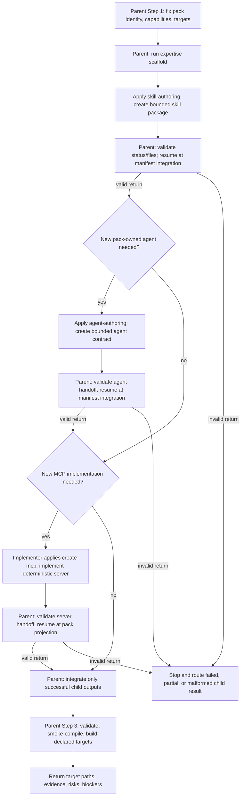
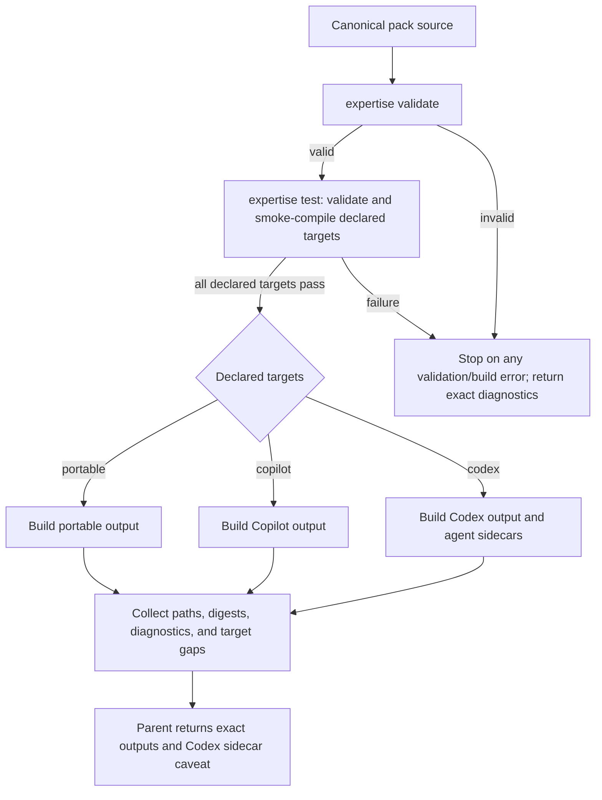

# Plugin Authoring Composition

The parent `plugin-engineering` workflow owns pack identity, capability scope, manifest integration, target validation, and the final handoff. Internal authoring workflows own only their bounded procedure. Every composed handoff MUST carry objective, relevant source requirements, constraints, expected output, and the exact parent resume point; validate the explicit return before continuing.

## use_case: author_plugin_with_optional_contributions

Select the `skill-authoring` workflow for each required skill package and `agent-authoring` only when a new pack-owned persona is needed. Delegate new MCP server code to Implementer with the `create-mcp` workflow; existing servers use their authoritative catalog. DevOps owns host configuration, installation, and deployment.

Each child returns control to its named parent resume node; the parent MUST NOT continue from an assumed implicit return. Optional branches terminate at the join and all routes end in either a validated build handoff or a blocker.

## use_case: compile_selected_targets_from_one_source

Build only targets declared in the manifest. When several targets are promised, every declared target must succeed before returning success.