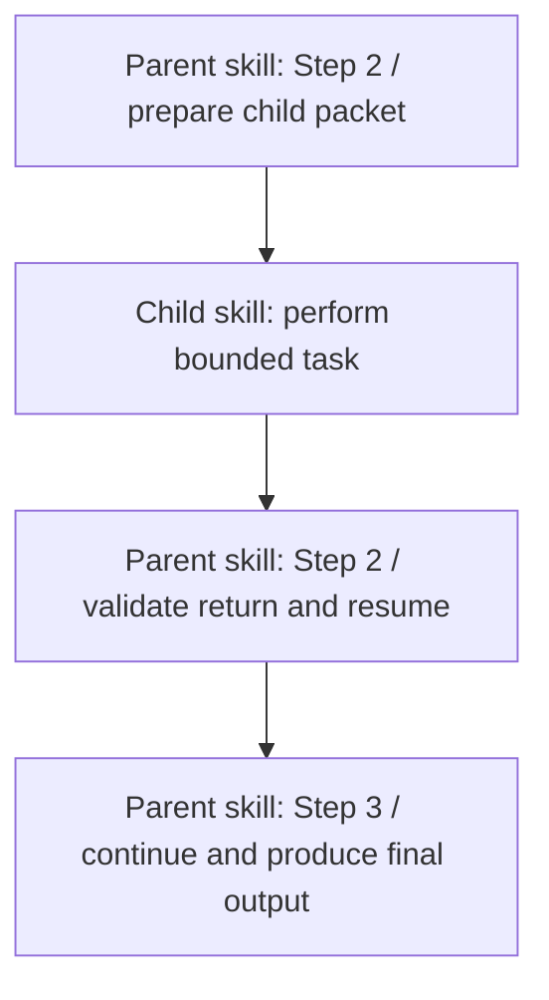
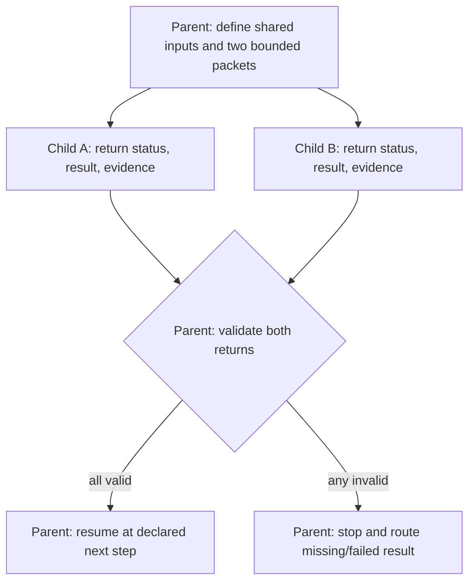

# Skill Composition Contract

A skill may invoke another skill at a defined point in its workflow. This is a bounded child call, not a transfer of control that erases the caller's workflow.

In this workspace, load a child package through the host's native `skill` invocation, using the exact installed skill name. Skill package names belong in `<agent-skills>`, not in the agent's `tools` list; the agent may allowlist the native `skill` invocation tool. A skill defines a workflow—it is not a deterministic callable operation, does not grant tools, and does not switch agent identity. The current agent executes the child workflow and retains ownership of its own continuation.

## Handoff packet

Before invoking a child skill, pass only the context it needs:

- `objective`: the child action and why it is needed now.
- `inputs`: relevant content, evidence, and stable artifact IDs/revisions.
- `constraints`: scope, decisions already made, and prohibited changes.
- `expected_output`: required result fields and completion evidence.
- `resume_point`: the exact parent workflow action to continue after return.

The child skill MUST treat that packet as its complete task boundary, MUST return its result and status explicitly, and MUST identify blockers, missing inputs, deviations, and produced evidence. It MUST NOT assume the parent will infer success from an output artifact or tool trace.

## Return and resume

The return contract consists of an explicit status, required output fields, produced evidence/IDs, deviations, and blockers. After a child returns, the parent MUST check its status and required output fields against `expected_output`. On success, consume the result and continue from the packet's `resume_point`; on partial, failed, blocked, or malformed output, stop or route remediation instead of continuing as if successful. The parent retains ownership of its remaining workflow and final output contract.

Child results should carry the IDs/revisions they consumed and the IDs/revisions they produced. Do not copy unrelated parent history into the packet; pass the smallest context that preserves correctness.

## DAG semantics

Model a composed workflow as a directed acyclic graph (DAG). A child edge means “invoke now”; the explicit return edge means “resume this parent state with the child's result.” Represent the parent continuation as a distinct node after the child, rather than an implicit edge back to the original node. That makes the return point and downstream dependencies visible.

Composition MUST NOT create recursive skill calls or a cycle. Iteration is represented as successive, versioned nodes and edges with explicit exit conditions, not as a back-edge. If a child needs an ancestor capability, the parent should provide that operation's result in the packet rather than having the child invoke the ancestor.

Every non-trivial composition use case MUST have a Mermaid `flowchart` showing the call, bounded data packet, return validation, and exact parent resume node. Parallel child calls MUST join before downstream work; conditional branches MUST terminate or converge explicitly. Show retry rounds as distinct finite nodes with an exit condition, never as a cycle. Keep diagrams in the reference that owns the use case rather than copying the same graph into every skill.

## use_case: composed_skill_handoff

## use_case: parallel_children_with_join

Each child receives only its bounded packet. The parent validates both returns at the join before proceeding.

