# Deep-research composition contract

Use this reference only when a question needs more than one evidence workflow. Each selected procedure is an immediate workflow in the already loaded `research` domain; the current Researcher executes it. A workflow is not a separately discovered skill, deterministic tool call, or subagent, and it does not transfer the caller's decision ownership.

## Bounded child packet

Before each selected workflow, retain this bounded context in the current conversation:

- `objective`: the exact claim or sub-question assigned to this source class.
- `inputs`: the relevant question, requester, supporting artifact/revision, known context, and prior evidence IDs.
- `constraints`: source class, approved scope, read-only boundary, and any version or repository pin.
- `expected_output`: `status`, findings, exact source links/identifiers, evidence location, applicability, and uncertainty.
- `resume_point`: the exact next `deep-research` action, including the next selected source class or synthesis after the final child.

Workflow selection supplies the method instructions; it does not produce findings. Researcher executes the bounded procedure with the packet, then validates its return before resuming. A procedure returns `success`, `partial`, `failed`, or its exact admission `rejected` contract. A finding preserves its claim, evidence, source/revision, observation date where relevant, fact-versus-inference status, applicability, and uncertainty.

## Sequential source-class DAG

Select each needed class once. Skip unused branches; do not loop or retry a failed child. Validate each return before advancing. Any rejected, failed, or malformed result terminates composition with an explicit route or partial/failed result and the missing evidence.

```mermaid
flowchart TD
    start["Researcher: question + requester + artifact/revision + parent resume"]
    plan["Deep-research: define decision claim and finite source-class list"]
    need_github{"GitHub evidence needed?"}
    load_github["Select github-evidence-research workflow"]
    github["Execute bounded GitHub evidence workflow"]
    check_github{"Validate status, pin, findings, sources"}
    need_paper{"Scholarly evidence needed?"}
    load_paper["Select paper-research workflow"]
    paper["Execute bounded paper workflow"]
    check_paper{"Validate status, publication state, findings, sources"}
    need_docs{"Versioned documentation needed?"}
    load_docs["Select versioned-documentation-research workflow"]
    docs["Execute bounded versioned-documentation workflow"]
    check_docs{"Validate status, version, findings, sources"}
    need_general{"Uncovered general-source claim?"}
    general["Use available web/browser tools"]
    synthesize["Synthesize only validated evidence; preserve disagreement and gaps"]
    return_parent["Return status, findings, provenance, uncertainty, implications, exact parent resume"]
    stop["Stop and return rejection, partial, or failure with missing evidence"]
    start --> plan --> need_github
    need_github -->|yes| load_github --> github --> check_github
    need_github -->|no| check_github
    check_github -->|valid| need_paper
    check_github -->|invalid| stop
    need_paper -->|yes| load_paper --> paper --> check_paper
    need_paper -->|no| check_paper
    check_paper -->|valid| need_docs
    check_paper -->|invalid| stop
    need_docs -->|yes| load_docs --> docs --> check_docs
    need_docs -->|no| check_docs
    check_docs -->|valid| need_general
    check_docs -->|invalid| stop
    need_general -->|yes| general --> synthesize
    need_general -->|no| synthesize
    synthesize --> return_parent
```

The declared resume point is returned unchanged to Researcher. Researcher validates the aggregate packet and resumes its own analysis/return step; the original requester receives only the compact evidence needed for its decision.
