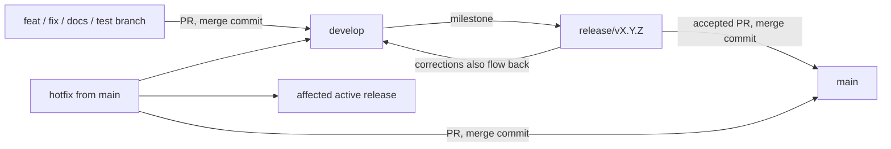

# Git and GitHub workflow

Git commits are durable provenance identifiers for agents and harnesses. A commit SHA that has been published or referenced in a handoff must continue to identify the same change.

## Branch roles

- `main` is the stable, released source of truth. Integrate releases and hotfixes through pull requests.
- `develop` is the active development source of truth and the normal base for new work.
- Work branches represent a coherent unit, not an agent or harness: `feat/<description>`, `fix/<description>`, `refactor/<description>`, `test/<description>`, `docs/<description>`, or `chore/<description>`. Start them from `develop` and open a PR back to `develop`.
- `release/vX.Y.Z` branches start from a specific `develop` milestone. Stabilize the release there while `develop` continues. Send release fixes back to `develop`; merge an accepted release into `main` and tag it `vX.Y.Z`.
- `hotfix/<description>` branches start from `main`. Merge the fix into `main`, then propagate it to `develop` and any active affected release branch. A published patch release receives a new patch tag.
- Do not create branches per agent. Never force-push or delete history to make branches appear aligned.

## Commits and pull requests

- Use Conventional Commit types: `feat`, `fix`, `refactor`, `test`, `docs`, and `chore`. Add a scope when it clarifies the change, for example `fix(codex): preserve stdin transport`.
- For each significant, coherent, task-owned change that is stable enough to discuss, commit it, push its work branch, and create or update a PR. Preserve all unrelated local changes; never use a broad add operation that captures them.
- Preserve commit identity: do not squash, amend, rebase, or rewrite a commit after publishing it or referencing its SHA in a handoff. Use merge commits for PR integration. Never merge automatically.
- Keep PRs ready for review only when their work is sufficiently stable. Use `.github/PULL_REQUEST_TEMPLATE.md`, report actual validation results, and expose open questions. ChatGPT Work reads PRs and summarizes them; it does not implement, comment, or choose the next architecture step. The user decides major architecture and follow-up work.

## Review flow

## Repository setup checkpoint

As inspected on 2026-09-27, the local `main` (`v1.0.0`) and GitHub `main` (`v0.0.0`) have separate, unrelated histories. The remote has a `dev` branch but no `develop` branch. Do not rename or repoint either line of history, or start the new base-branch flow, until the user chooses how `dev` and the two histories should be reconciled. No artificial release branch is needed now.

Repository protection should require PRs for `main` and `develop`, allow merge commits, disallow force-push, and require only checks that exist. Do not add a rule that blocks all valid changes. Confirm available GitHub permissions and current rules before changing repository settings; report settings that need an administrator.
