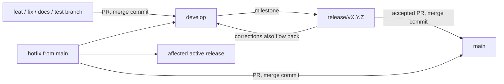

# Git and GitHub workflow

Git commits are durable provenance identifiers for agents and harnesses. A commit SHA that has been published or referenced in a handoff must continue to identify the same change.

## Branch roles

- `main` is the stable, released source of truth. Integrate releases and hotfixes through pull requests.
- `develop` is the active development source of truth and the normal base for new work.
- Work branches represent a coherent unit, not an agent or harness: `feat/<description>`, `fix/<description>`, `refactor/<description>`, `test/<description>`, `docs/<description>`, or `chore/<description>`. Start them from `develop` and open a PR back to `develop`.
- `release/vX.Y.Z` branches start from a specific `develop` milestone. Stabilize the release there while `develop` continues. Send release fixes back to `develop`; merge an accepted release into `main` and tag it `vX.Y.Z`.
- `hotfix/<description>` branches start from `main`. Merge the fix into `main`, then propagate it to `develop` and any active affected release branch. A published patch release receives a new patch tag.
- Do not create branches per agent. Never force-push or delete history to make branches appear aligned.

## Commits and pull requests

- Use Conventional Commit types: `feat`, `fix`, `refactor`, `test`, `docs`, and `chore`. Add a scope when it clarifies the change, for example `fix(codex): preserve stdin transport`.
- For each significant, coherent, task-owned change that is stable enough to discuss, commit it, push its work branch, and create or update a PR. Preserve all unrelated local changes; never use a broad add operation that captures them.
- Preserve commit identity: do not squash, amend, rebase, or rewrite a commit after publishing it or referencing its SHA in a handoff. Use merge commits for PR integration. Never merge automatically.
- Keep PRs ready for review only when their work is sufficiently stable. Use `.github/PULL_REQUEST_TEMPLATE.md`, report actual validation results, and expose open questions. ChatGPT Work reads PRs and summarizes them; it does not implement, comment, or choose the next architecture step. The user decides major architecture and follow-up work.

## Review flow

## Repository setup checkpoint

As inspected on 2026-09-27, the user designated local `main` at `5c6dcd401e9a0d115e79c19f02de96ffed694686` as the canonical new lineage. GitHub `main` at `0b442b17a4d4a03f3028907c4b428ff4a4ce6034` is a separate historical lineage; do not merge the unrelated histories. Its tip and the old `dev` tip (`f09869479c9619659a105243b3d543cdacd2aa64`) are preserved at `archive/pre-v0.1-main` and `archive/pre-v0.1-dev`. The local annotated `v0.0.0` tag points to the old main commit but is not published on GitHub; local `v1.0.0` points to the current local `main`. The requested `v0.1.0` checkpoint needs confirmation against that existing tag before publishing. Keep remote `main` and `dev` unchanged until active local work is classified and committed and the release checkpoint is approved. Then publish the canonical lineage, create `develop` from it, and retire `dev` only after verifying both new refs and the archive.

Repository protection should require PRs for `main` and `develop`, allow merge commits, disallow force-push, and require only checks that exist. Do not add a rule that blocks all valid changes. Confirm available GitHub permissions and current rules before changing repository settings; report settings that need an administrator.

## Workspace configuration and generated files

See [`tracking-inventory.md`](./tracking-inventory.md) for the checkpoint's file-by-file ownership and staging classification.

- `.agents/plugins/marketplace.json` is project configuration: it exposes the repository-local `agentic-core` plugin through a relative path and can be versioned.
- `.markdownlint.json` is shared repository lint configuration and can be versioned.
- `.vscode/settings.json` currently combines the shared Copilot skill-tool setting with a personal `editor.wordWrap` preference. Keep it local until those settings are split or the user chooses to share both.
- `.vscode/copilot-tools.snapshot.json` is generated workspace state and is ignored.
- `.tools/bin/waza` and `.tools/bin/extension.yaml` are a locally installed executable and its generated extension manifest; both are ignored. Record installation instructions if the tool later becomes a reproducible project dependency.
- Python bytecode/caches and raw `outputs/skillopt-create-skill*/` runs are ignored. Curated evidence such as `outputs/evals/baseline-inventory-r7.json` remains trackable and retains its task ownership.
- The root README currently combines task_3-owned harness content with plugin changes; preserve it until its changes can be separated by owner.
